# Brownie

## 1. Homepage

  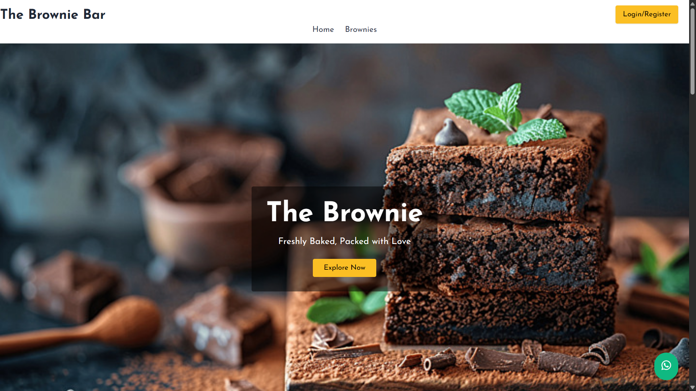 
  

## 

  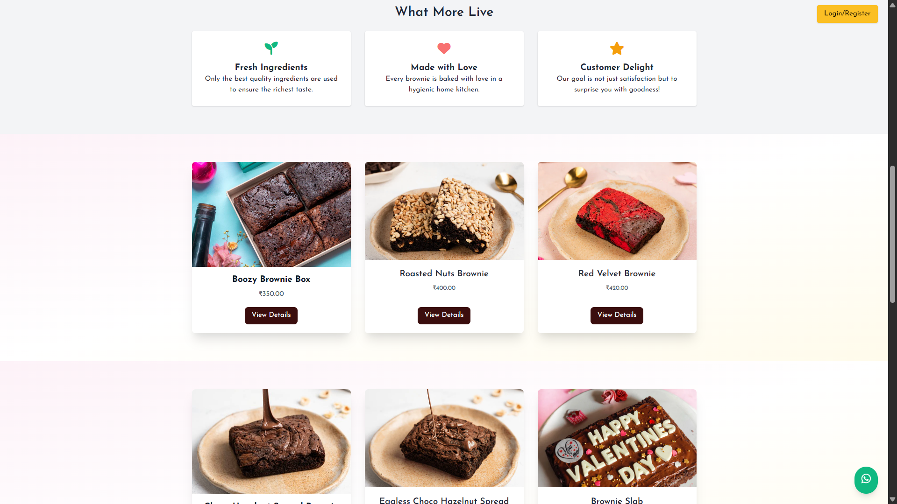 

##

  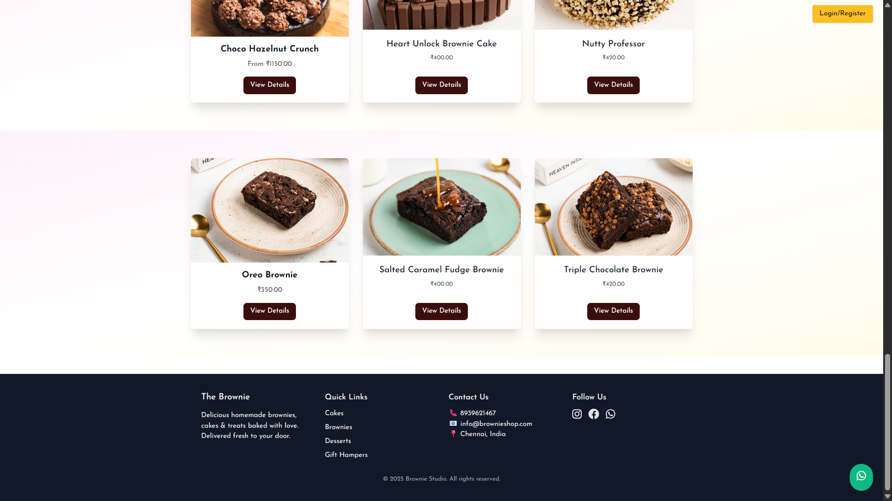 

## 2. Login

  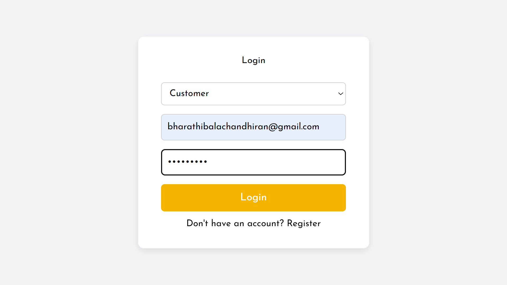 
  <b>Image 4</b>

## 3. Register

  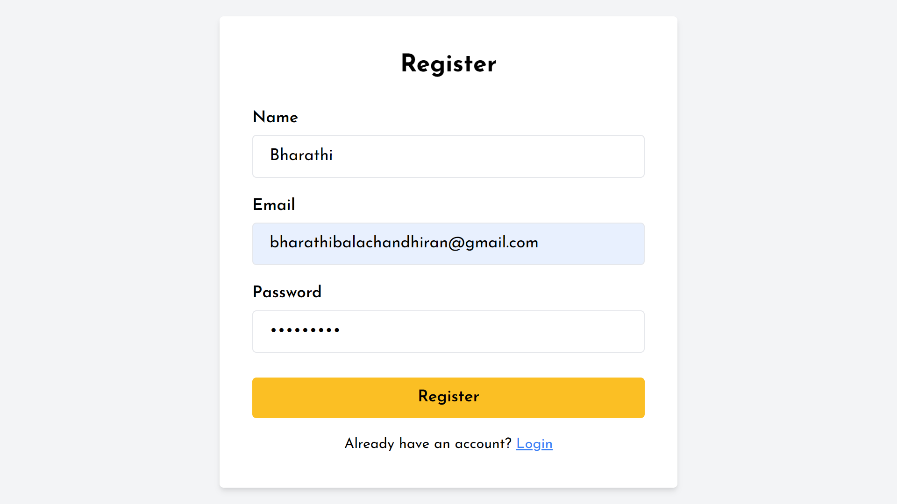 
  <b>Image 5</b>

## 4. Customer Page after login

  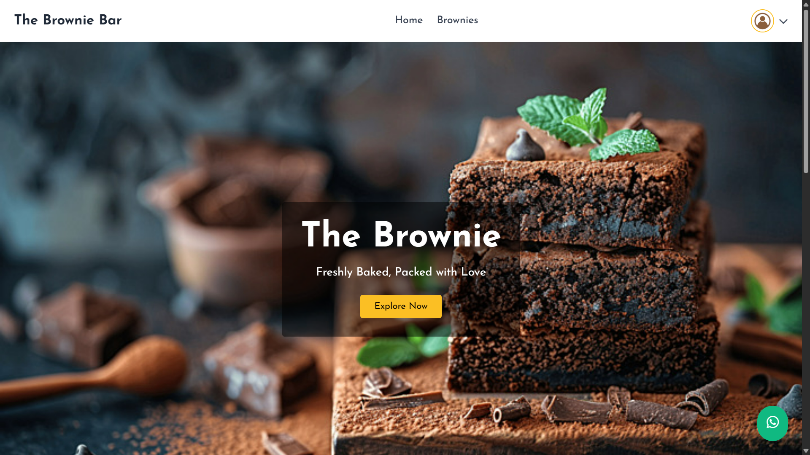 

## 5. Available Products

  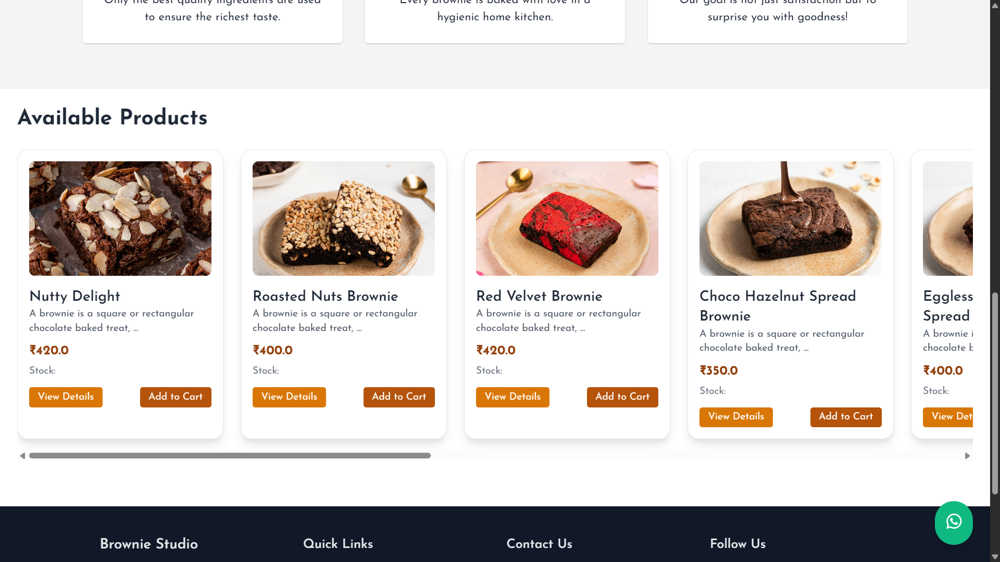 

## 6. Product Details

  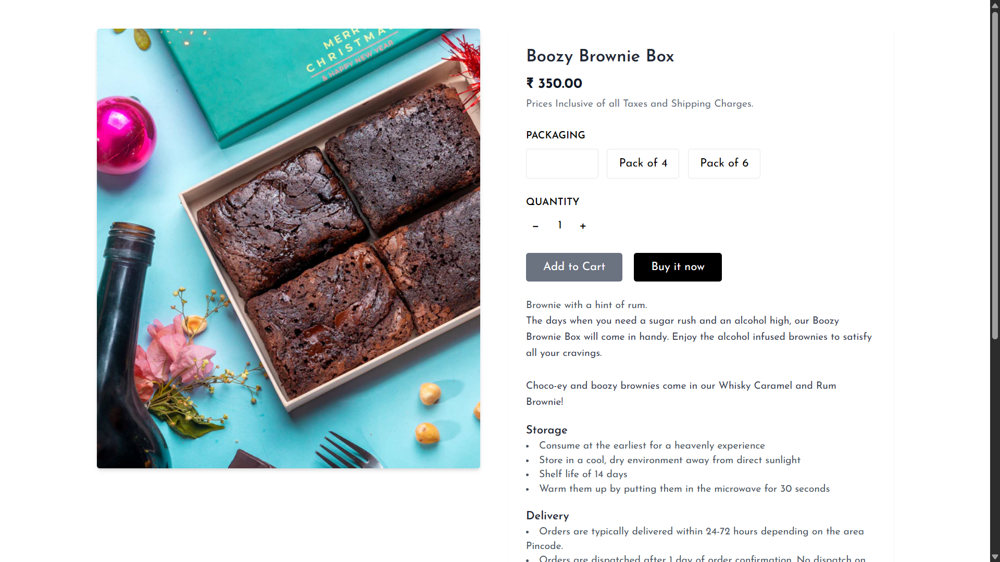 
  <b>Image 8</b>

## 7. Checkout

  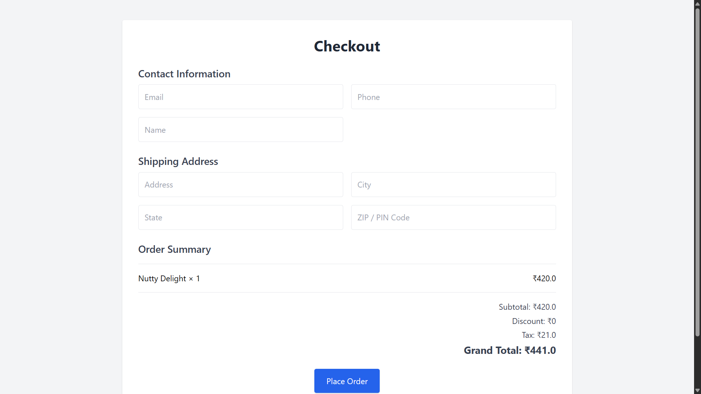 
  <b>Image 9</b>

## 8. Order Success

  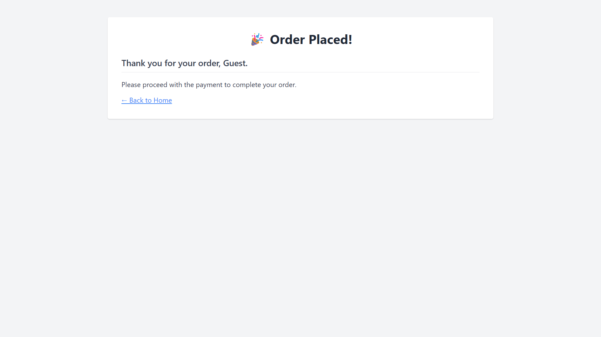 

## 

  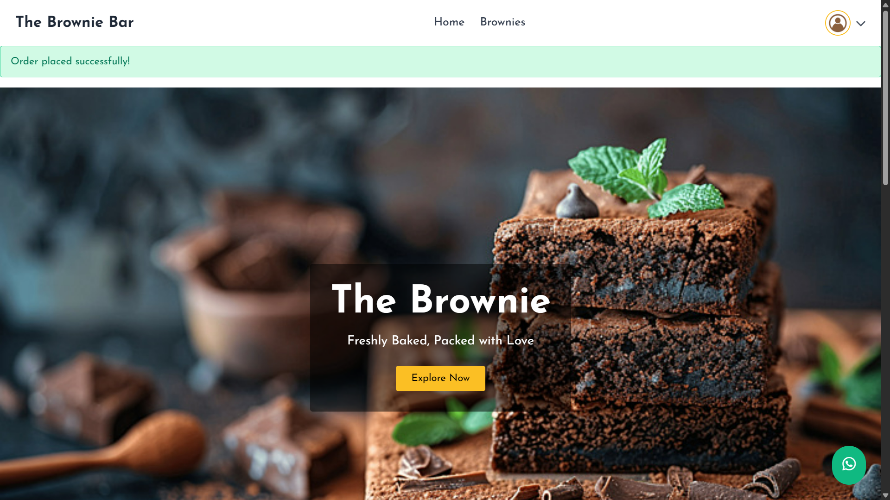 

## 9. Manage Profile

  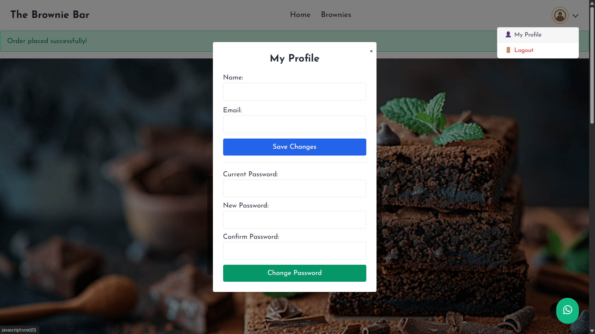 

## 10. Explore Collection

  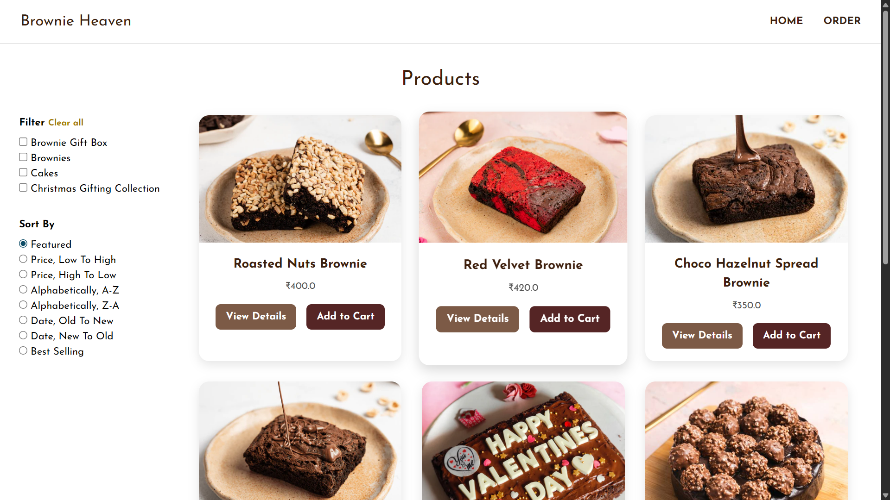 

## 11. Admin Dashboard

  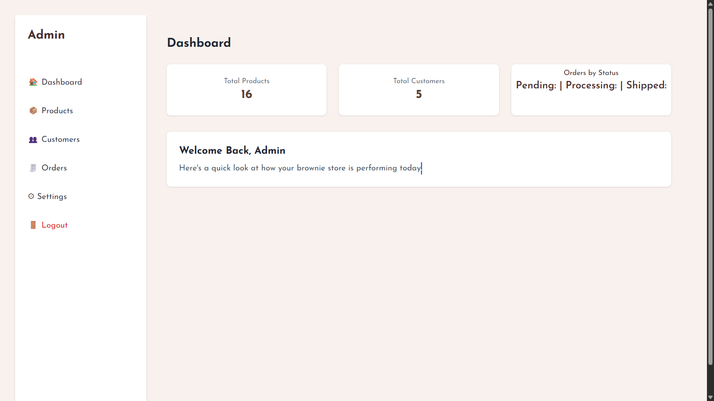 

## Admin Dashboard - Product

  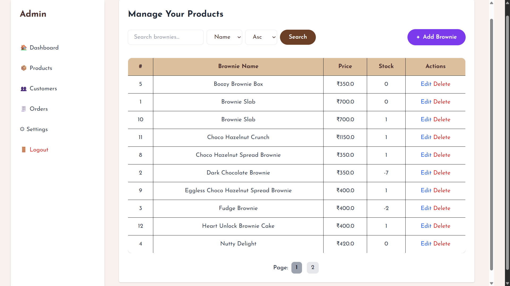 

## Admin Dashboard - Order

  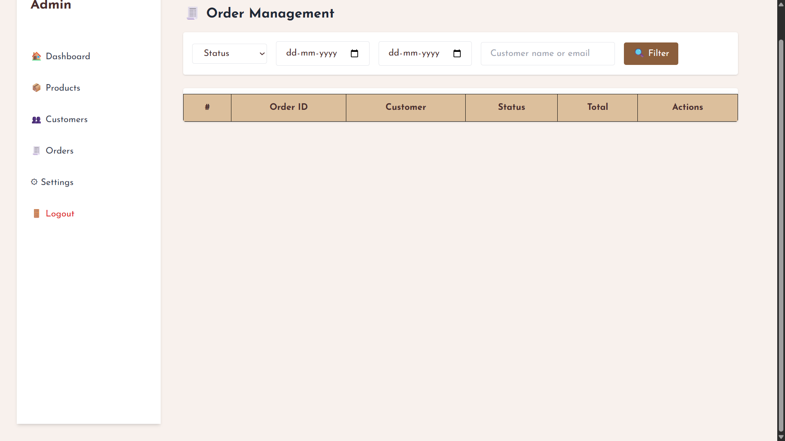 

## Admin Dashboard - Settings

  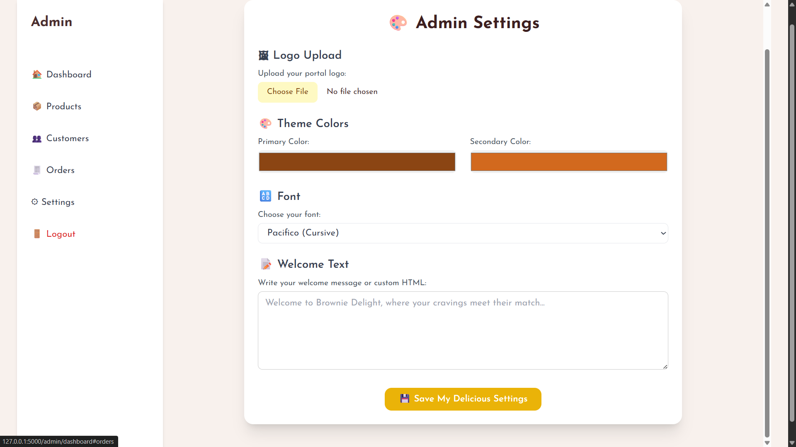 

